# Cppfort Aspirations: A C++2 Transpiler Journey

## Project Overview

Cppfort is a pattern-driven transpiler that converts C++2 (cpp2) syntax - a cleaner, more expressive variant of C++ - into standard C++20 code. The project aims to achieve self-hosting through incremental, honest implementation without shortcuts or architecture astronautics.

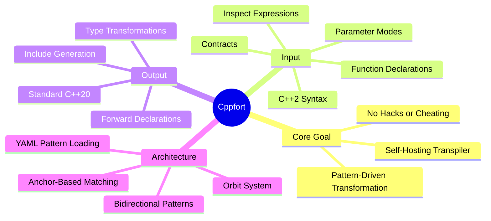

## Current Status

As of October 2025, the project is in early stages with minimal working functionality.

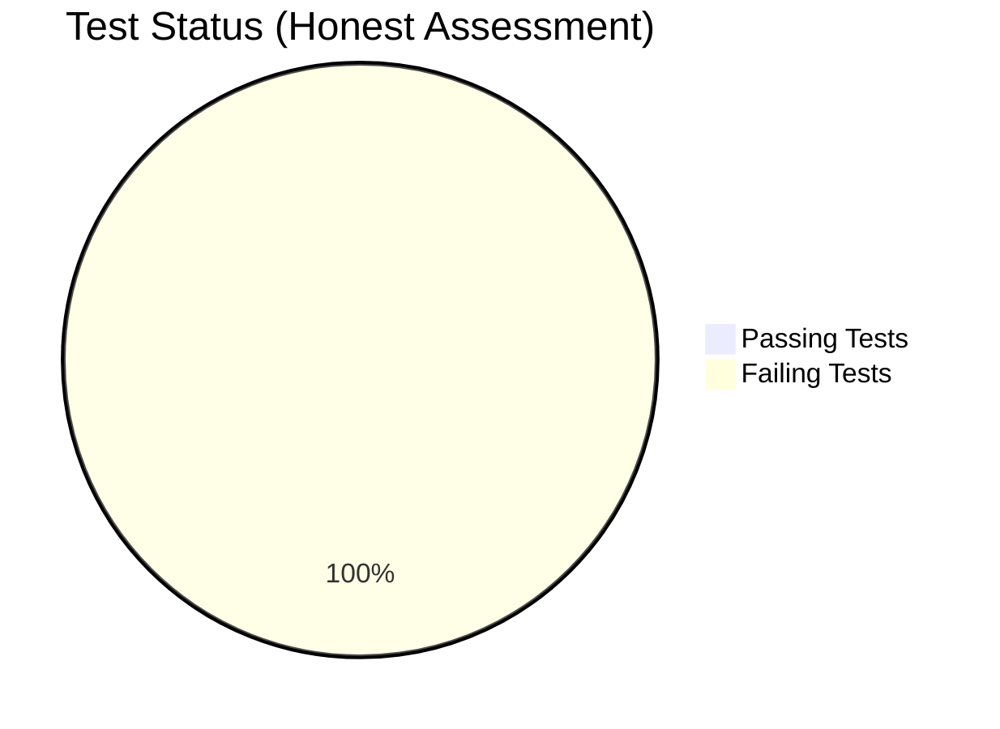

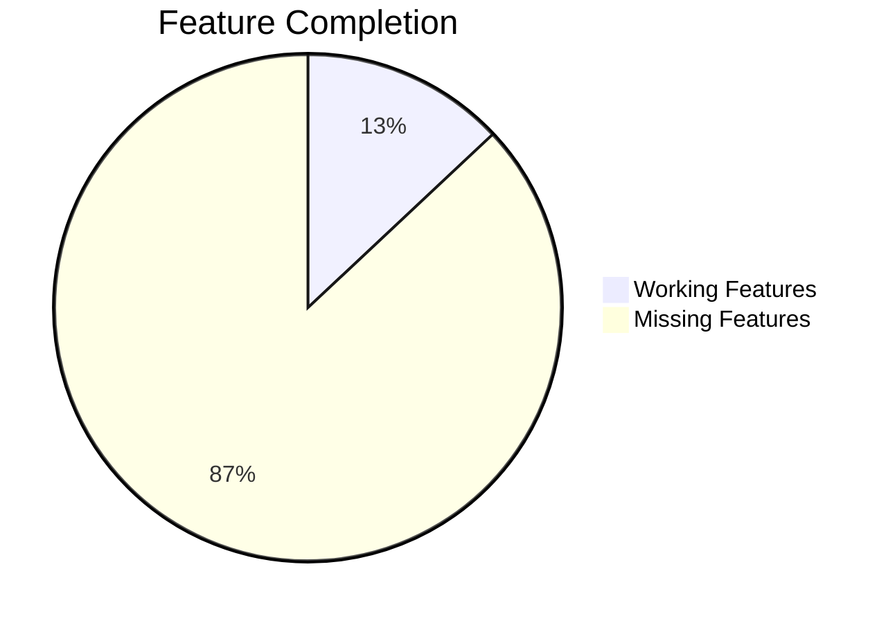

### Reality Check Metrics
- **Working Features**: 3/8 (37.5%) - simple main, template alias, walrus operator
- **Passing Tests**: 0/192 (0%)
- **Can Transpile Hello World**: NO
- **Can Self-Host**: NO
- **Lines of Working Code**: ~500 of 5000+

## Implementation Roadmap

The project follows a strict "one feature at a time" approach with progress gates.

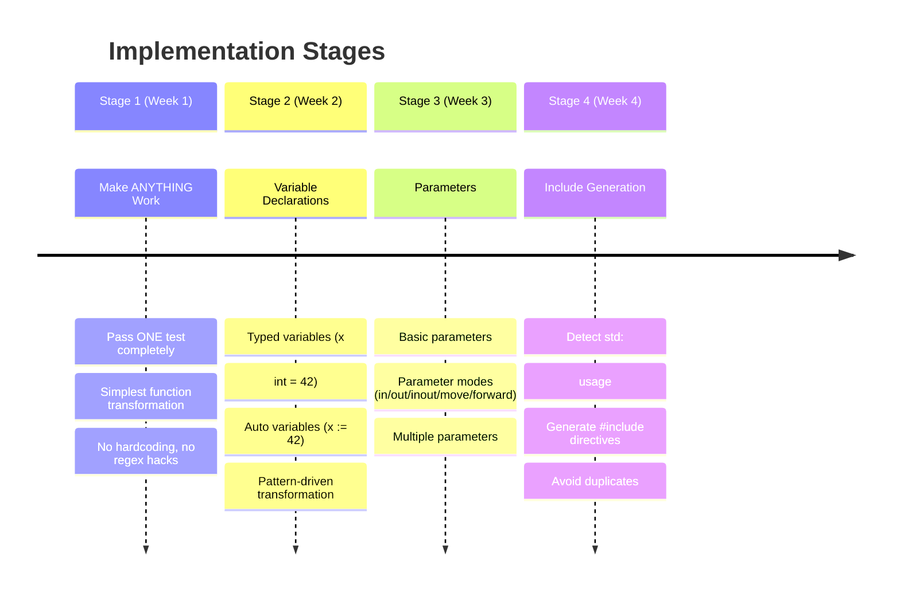

## Core Aspirations

### 1. Honest Implementation
No fake progress, no marking incomplete features as done, no architecture without working code.

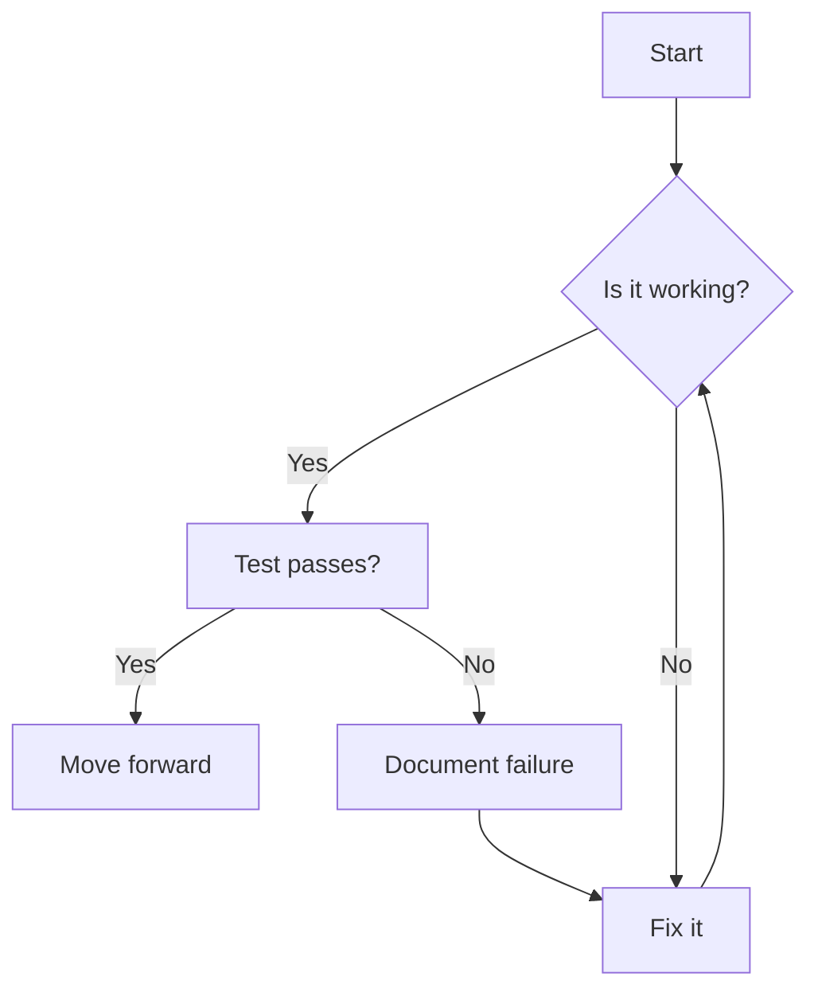

### 2. Pattern-Driven Transformation
All transformations must be driven by declarative patterns, not hardcoded logic.

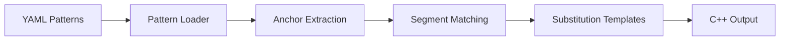

### 3. Self-Hosting Path
Ultimate goal: the transpiler can compile itself.

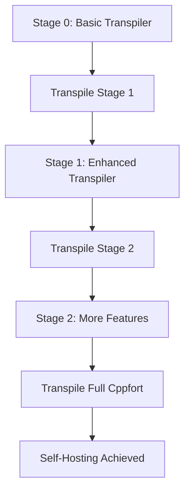

## Feature Aspirations

### Level 0: Minimal Viable (REQUIRED)
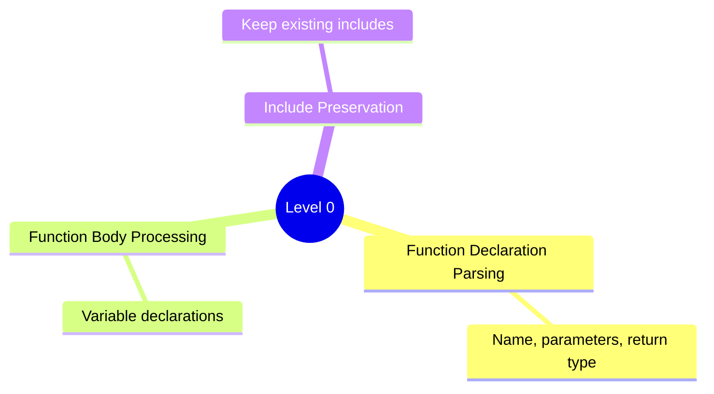

### Level 1: Basic Parameters
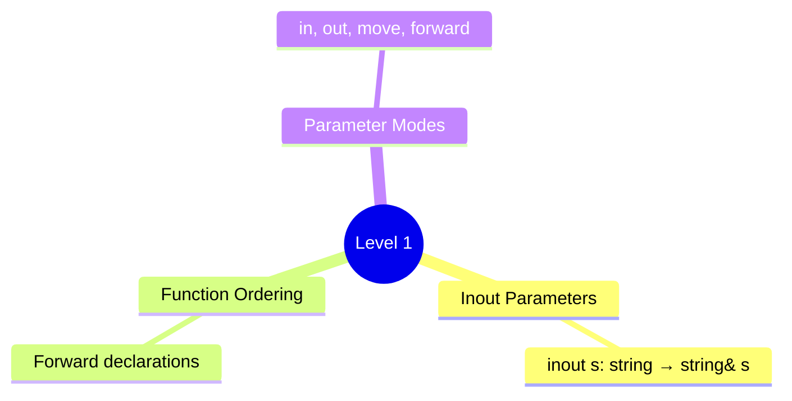

### Level 2: Type System
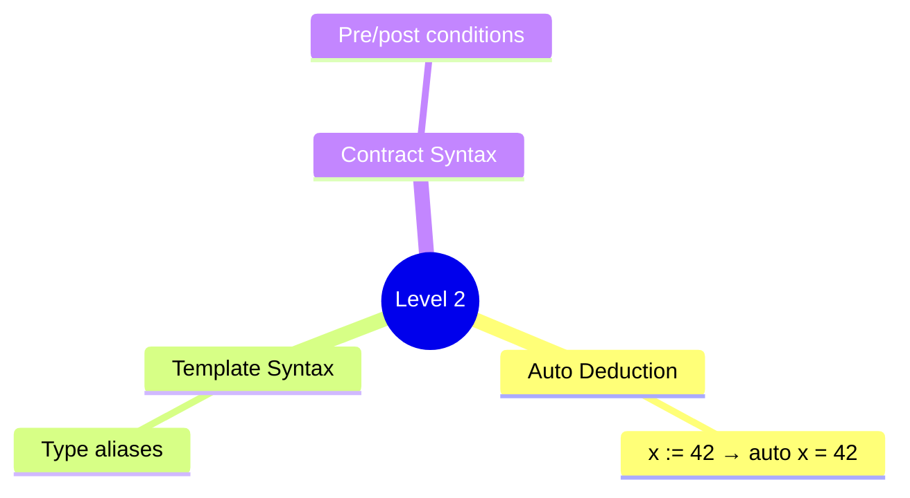

### Level 3: Advanced Features
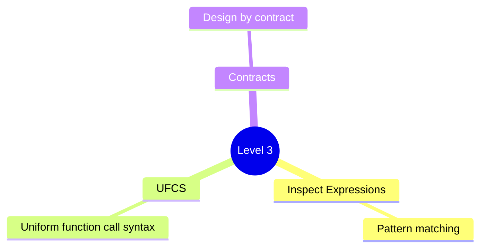

## Implementation Gaps

Critical missing functionality that prevents basic transpilation.

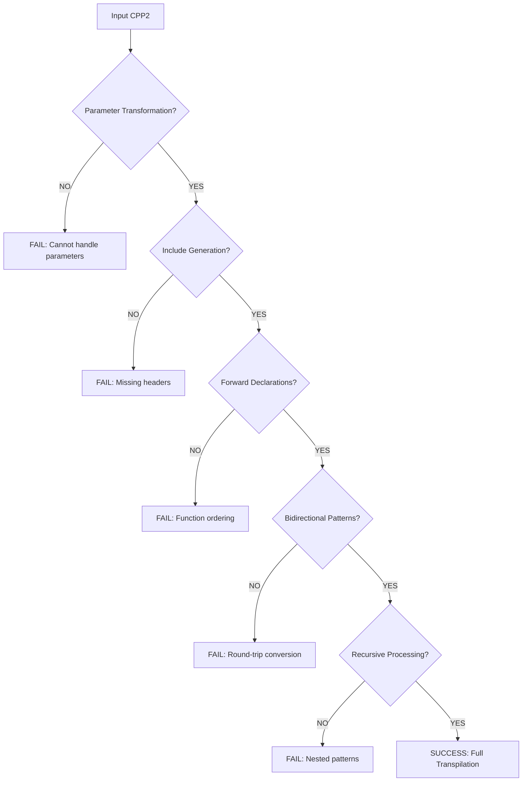

## Success Metrics

### Milestones
```mermaid
gantt
    title Project Milestones
    dateFormat  YYYY-MM-DD
    section Minimal
        Milestone 1: 1 test passing    :done, m1, 2025-10-01, 1d
        20% features working          :done, f1, 2025-10-01, 1d
        Hello world transpilation      :done, h1, 2025-10-01, 1d
    section Basic
        Milestone 2: 10 tests passing  :active, m2, 2025-11-01, 30d
        40% features working          :f2, 2025-11-01, 30d
        Simple programs                :s1, 2025-11-01, 30d
    section Functional
        Milestone 3: 50 tests passing  :m3, 2025-12-01, 60d
        60% features working          :f3, 2025-12-01, 60d
        Most programs                  :s2, 2025-12-01, 60d
    section Complete
        Milestone 4: 150+ tests passing :m4, 2026-02-01, 90d
        90%+ features working         :f4, 2026-02-01, 90d
        Self-hosting                   :sh, 2026-02-01, 90d
```

## Anti-Patterns to Avoid

### What NOT to Do
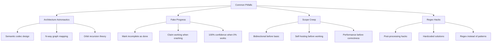

## The Truth Test

The ultimate measure of progress: can it transpile and run real code?

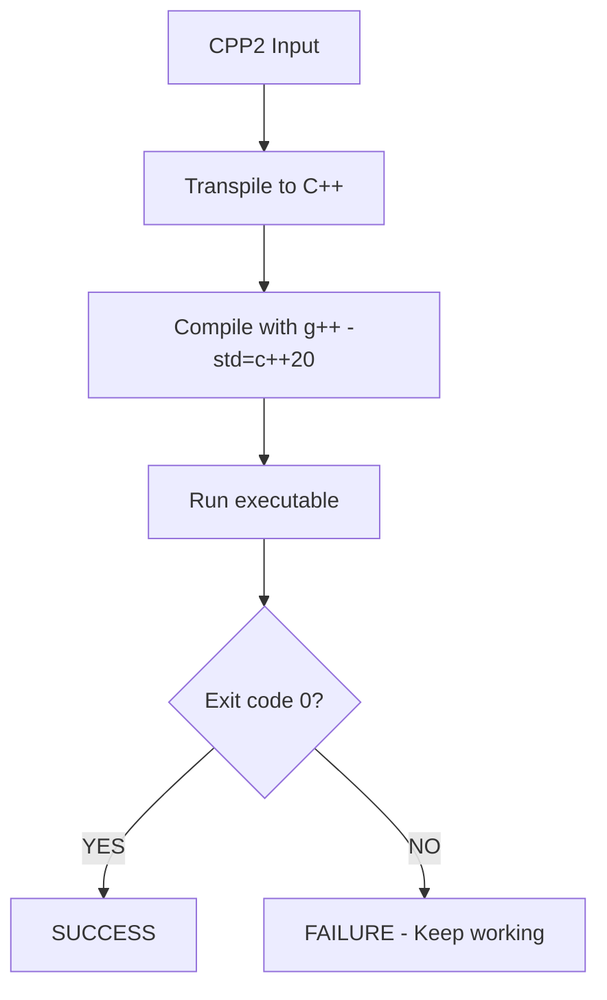

## Daily Progress Ritual

```
Date: YYYY-MM-DD
Tests Passing: X/192
Features Complete: [Actual working features]
Current Stage: X.X
Blocking Issue: [What's preventing next test]
Lines Changed: +X -Y
Honest Assessment: [Can it transpile anything useful?]
```

## Core Mantra

**Make it work, make it right, make it fast - IN THAT ORDER**

Currently: Nothing works.  
Goal: Make something work.  
Everything else can wait.