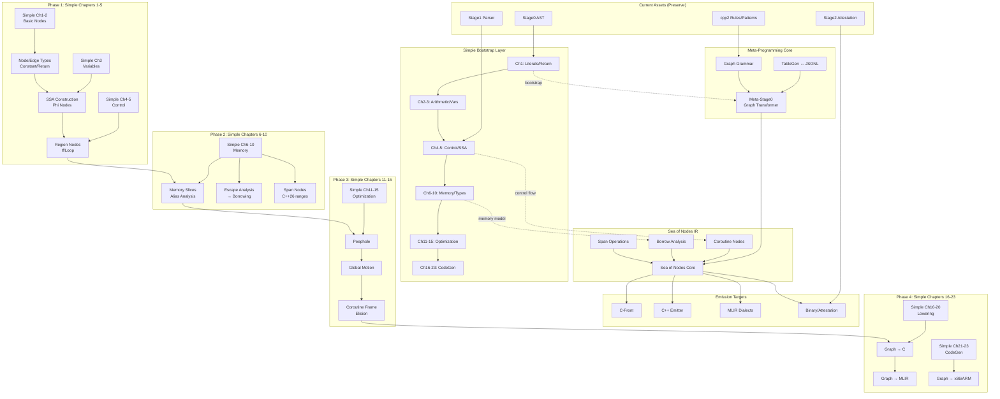
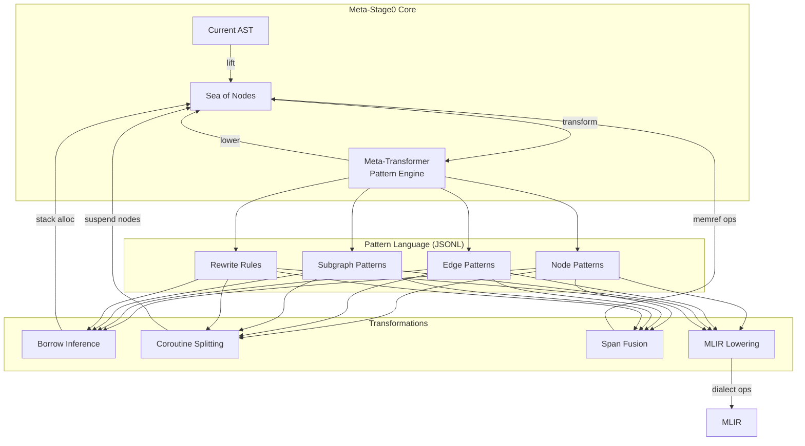
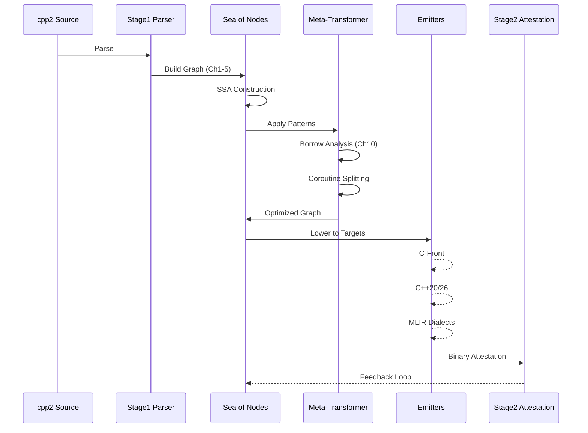

# cppfort – Three‑Stage Compilation Pipeline

> **Sea of Nodes IR Investigation**: This branch explores integrating a Sea of Nodes intermediate representation
> following the Simple compiler tutorial approach. The architecture aims to provide borrowing analysis,
> C++20 coroutine support, C++26 spans, and MLIR dialect generation through meta-programming transformations.
> See architecture diagrams below for the complete vision.

## Overview

The project implements a three‑stage pipeline for the **cpp2** language:

| Stage | Purpose | Main Target |
|------|---------|-------------|
| **0** | Core C++ infrastructure (AST, Emitter, documentation support). | `src/stage0` |
| **1** | **cpp2 → C++ transpiler**. Reads a `.cpp2` file, builds a minimal `TranslationUnit`, and emits C++ using the Stage 0 emitter. | `src/stage1` |
| **2** | **Decompilation & differential analysis pipeline**. Disassembles binaries at multiple optimization levels, extracts assembly patterns, performs differential tracking to identify optimization transformations, and exports pattern databases for TableGen integration. | `src/stage2` |

## Building the Project

```bash
# From the repository root
mkdir -p build && cd build
cmake .. -DCMAKE_BUILD_TYPE=Debug
cmake --build .
```

The above will build:

* `stage0_cli` – emits C++ from a `.cpp2` file.
* `stage1_cli` – transpiles a `.cpp2` file to C++ (wrapper around Stage 0).
* `anticheat` – command‑line helper for decompilation and differential analysis (`src/stage2/anticheat_cli`).

## Running the Transpiler (Stage 1)

```bash
./stage1_cli <input_file.cpp2> <output_file.cpp>
```

Example:

```bash
./stage1_cli src/stage1/main.cpp2 stage1_output.cpp
```

## Running the Anticheat (Stage 2)

```bash
./anticheat <path_to_binary>
```

The tool prints a SHA‑256 hash of the binary's `objdump -d` disassembly.

## Regression Test Harness

### Triple Induction Testing Framework

The project implements a **triple induction** feedback loop where each stage improves the others:

* **Stage 2 → Stage 1**: Attestation validates transpilation produces deterministic binaries
* **Stage 1 → Stage 0**: Error analysis guides AST and emitter improvements
* **Stage 0 → Stage 2**: Roundtrip validation ensures semantic correctness

Run the complete triple induction test suite:

```bash

chmod +x regression-tests/run_triple_induction.sh
regression-tests/run_triple_induction.sh
```

### Individual Test Suites

**Basic Regression Tests** (Stage 0/1 comparison):

```bash

regression-tests/run_tests.sh
```

**Attestation Tests** (Stage 2→1 feedback):

```bash
regression-tests/run_attestation_tests.sh
```

**Error Analysis** (Stage 1→0 feedback):

```bash
regression-tests/run_error_analysis.sh
```

The framework provides detailed feedback on which components need improvement and prioritizes fixes by impact.

## Extending the Pipeline

* Add new `.cpp2` samples to `regression-tests/` and expand the test script as needed.
* Implement a full parser in Stage 1 to replace the current stub that builds a minimal `TranslationUnit`.
* Enhance the anticheat module to support additional verification mechanisms (e.g., signed attestations).

---

*© 2025 cppfort – cpp2 Compiler *⏺ Ultra-Architecture: Meta-Programmed Sea of Nodes via Simple Chapter Progression

  Overview: Preserve cpp2 Investment While Bootstrap-Lifting Through Simple

  The strategy leverages Simple's incremental chapter approach to meta-program our way to a Sea of
  Nodes IR, preserving all cpp2 induction work while escaping the destructive loop through explicit
  graph construction.

## Architecture Layers



## Meta-Programming Architecture



  Implementation Roadmap with Simple Progression

  Stage 0: Foundation (Simple Ch1-3)

  // Initial C-front target using Simple's basic nodes
  namespace cppfort::ir {
      class Node { /*Simple Ch1 */ };
      class ConstantNode : Node { /* literals */ };
      class ReturnNode : Node { /* control */ };
      class StartNode : Node { /* entry*/ };
  }

  Stage 1: Variables & SSA (Simple Ch3-5)

  // SSA construction during parsing
  namespace cppfort::ir {
      class PhiNode : Node { /*Simple Ch3 */ };
      class RegionNode : Node { /* Simple Ch4 */ };
      class IfNode : Node { /* control flow*/ };
  }

  Stage 2: Memory Model (Simple Ch6-10)

  // This is where borrowing analysis begins
  namespace cppfort::ir {
      class MemoryNode : Node { /*Simple Ch10 */ };
      class NewNode : Node {
          bool can_escape() const; // Borrowing analysis
          bool needs_heap() const; // Stack allocation decision
      };
      class LoadNode : Node { /* with span tracking */ };
      class StoreNode : Node { /* with alias analysis*/ };
  }

  Stage 3: Meta-Programming Layer

  // Meta-transformer using JSONL patterns
  namespace cppfort::meta {
      class GraphTransformer {
          void load_patterns(const jsonl::Document& patterns);
          SeaOfNodes transform(const SeaOfNodes& input);
      };

      // TableGen integration
      class MLIRDialectGen {
          jsonl::Document from_tablegen(const std::string& td_file);
          void to_dialect(const SeaOfNodes& graph);
      };
  }

  Stage 4: Coroutine Integration

  // C++20 coroutine suspension points
  namespace cppfort::ir {
      class SuspendNode : Node {
          int suspension_index;
          FrameSlot*frame_slots; // What needs preservation
      };
      class ResumeNode : Node { /* resume point */ };
      class CoroFrameNode : MemoryNode { /* frame allocation */ };
  }

  Stage 5: Advanced Optimizations

  // Borrowing pre-emption and span fusion
  namespace cppfort::opt {
      class BorrowingPass {
          void analyze_escapes(SeaOfNodes& graph);
          void convert_to_stack(NewNode* alloc);
      };

      class SpanFusionPass {
          void fuse_adjacent_spans(SeaOfNodes& graph);
          void optimize_ranges(LoadNode* load, StoreNode* store);
      };
  }

## Critical Integration Points


## Key Architectural Decisions

  1. Simple Chapter Progression: Follow Simple's 23 chapters but accelerate through meta-programming
  2. C-Front First: Target C emission initially (simpler than C++) to validate graph construction
  3. JSONL Patterns: Use JSONL for pattern definitions (more flexible than TableGen initially)
  4. Preserve cpp2: All cpp2 rules become graph transformation patterns, not lost
  5. Incremental Adoption: Each Simple chapter adds capabilities without breaking existing code

  Benefits of This Architecture

  1. Escape Induction Trap: Explicit graph transformations prevent destructive loops
  2. Borrowing Natural: Ch10's memory model provides perfect foundation for escape analysis
  3. Coroutine Integration: Suspension points are just special nodes in the graph
  4. MLIR Bridge: Graph structure maps directly to MLIR operations
  5. Attestation Compatible: Deterministic graph ordering ensures reproducible binaries

