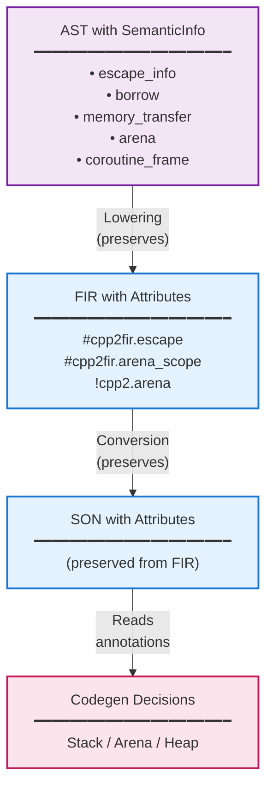
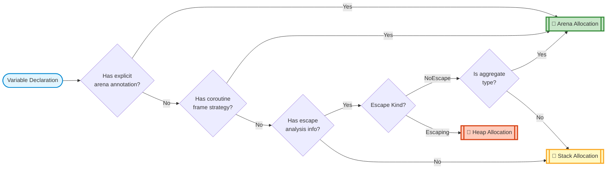

# JIT Architecture: MLIR Pipeline (Mermaid Diagram)

## Architecture Flow Diagram

```mermaid
flowchart TD
    Source["CPP2 SOURCE CODE<br/>main.cpp2"]
    
    Parser["PARSER (parser.cpp)<br/>━━━━━━━━━━━━━━━━━━━━━━<br/>Lexical Analysis → Combinator Parsing → AST Construction<br/>(lexer.cpp) → (combinators/) → (ast.hpp)"]
    
    Semantic["SEMANTIC ANALYSIS (semantic_analyzer.cpp)<br/>━━━━━━━━━━━━━━━━━━━━━━━━━━━━━━━━━━━━━━━━━━━━━<br/>Type Checking → Escape Analysis → Borrow Checking → Lifetime<br/>(Phase 1-2) → (Phase 1-2) → (Phase 2) → (Phase 2)<br/><br/>ATTACHES SemanticInfo to AST nodes:<br/>• escape_info: EscapeKind<br/>• borrow: OwnershipKind<br/>• memory_transfer: GPU/DMA tracking<br/>• channel_transfer: Send/recv tracking<br/>• arena: ArenaRegion<br/>• coroutine_frame: CoroutineFrameStrategy"]
    
    ASTtoFIR["AST → FIR LOWERING<br/>(ast_to_fir.cpp - future work)<br/>━━━━━━━━━━━━━━━━━━━━━━━━━━━━━━<br/>Convert AST nodes to Cpp2FIR dialect operations<br/><br/>AST::VariableDeclaration → cpp2fir.var<br/>AST::FunctionDeclaration → cpp2fir.func<br/>AST::BinaryExpression → cpp2fir.add, cpp2fir.mul"]
    
    FIR["FIR: Cpp2 Front-IR (Cpp2FIRDialect.td)<br/>━━━━━━━━━━━━━━━━━━━━━━━━━━━━━━━━━━━━━━━<br/>HIGH-LEVEL SEMANTIC OPERATIONS<br/><br/>Operations: var, func, add, mul, call, if, while<br/>Attributes:<br/>• #cpp2fir.escape<'no_escape|heap|return|param|global'><br/>• #cpp2fir.arena_scope<scope_id><br/>• !cpp2.arena<scope_id, pointee_type><br/><br/>FIR is ANNOTATED with semantic info from AST"]
    
    OptPasses["OPTIMIZATION PASSES<br/>(FIR-level analysis)<br/>━━━━━━━━━━━━━━━━━━━━━━━━<br/>• FIRTransferElimination (Phase 3)<br/>  - Uses escape attrs<br/>  - Removes GPU/DMA transfers for NoEscape<br/><br/>• FIRDMASafety (Phase 3)<br/>  - Validates DMA safety"]
    
    JITPasses["JIT ALLOCATION PASSES (Phase 7-10)<br/>Run ON FIR, NOT lowering to SON<br/>━━━━━━━━━━━━━━━━━━━━━━━━━━━━━━━━━━━━<br/>• FIRArenaInferencePass<br/>  - Analyzes NoEscape aggregates<br/>  - Assigns arena scope IDs<br/>  - Tags with #cpp2fir.arena_scope<br/><br/>• FIRCoroutineFrameSROAPass<br/>  - Detects non-escaping coroutines<br/>  - Tags with coroutine_frame attr<br/><br/>KEY: These run on FIR DIRECTLY<br/>NO lowering to SON required!"]
    
    FIRtoSON["FIR → SON LOWERING (ConvertFIRToSON.cpp)<br/>━━━━━━━━━━━━━━━━━━━━━━━━━━━━━━━━━━━━━━━━━━━<br/>Pattern-based dialect conversion:<br/><br/>cpp2fir.add → sond.add<br/>cpp2fir.mul → sond.mul<br/>cpp2fir.func → sond.func<br/><br/>SEMANTIC ATTRIBUTES are PRESERVED:<br/>• Escape analysis info → passed through<br/>• Arena annotations → attached to SON ops<br/>• Memory transfer info → preserved"]
    
    SON["SON: Sea of Nodes (Cpp2SONDialect.td)<br/>━━━━━━━━━━━━━━━━━━━━━━━━━━━━━━━━━━━━━━<br/>LOW-LEVEL OPTIMIZABLE IR<br/><br/>Based on 'Sea of Nodes' design:<br/>• CFG Nodes: Start, Stop, Region, Loop, If, CProj<br/>• Data Nodes: Add, Mul, Div, Phi, etc.<br/>• Types: Control, Memory, Integer (with lattices)<br/><br/>UNIFIED control+data flow representation"]
    
    SONOpt["SON OPTIMIZATION PASSES<br/>━━━━━━━━━━━━━━━━━━━━━━━━━━━━<br/>• SCCP (Sparse Conditional Constant Propagation)<br/>  - Optimistic type propagation from TOP→BOTTOM<br/>  - Interprocedural analysis<br/>  - Uses type lattice for monotone framework<br/><br/>• IterPeeps (Iterative Peephole)<br/>  - Random worklist order for coverage<br/>  - Applies fold() and idealize() until fixed point<br/><br/>• DCE (Dead Code Elimination)<br/>• CSE (Common Subexpression Elimination)<br/>• Loop optimizations"]
    
    OptSON["OPTIMIZED SON<br/>(still has semantic annotations!)<br/>━━━━━━━━━━━━━━━━━━━━━━━━━━━━━━━━━━<br/>IMPORTANT: SON is NOT lowered further!<br/>We go DIRECTLY to codegen."]
    
    Codegen["CODE GENERATION (code_generator.cpp)<br/>━━━━━━━━━━━━━━━━━━━━━━━━━━━━━━━━━━━━━━━━<br/>Reads SEMANTIC INFO (from AST or preserved in IR)<br/>to make JIT allocation decisions:<br/><br/>determine_allocation_strategy(VariableDeclaration):<br/>  if (semantic_info.arena) → Arena<br/>  if (escape.kind == NoEscape && aggregate) → Arena<br/>  if (escape.kind == Escaping) → Heap<br/>  else → Stack<br/><br/>Generates C++ with allocation comments:<br/>  int x(42);  // Allocation: stack (NoEscape local)<br/>  cpp2::arena_alloc<std::vector>(arena<1>(), {})<br/>    // Allocation: arena scope 1 (NoEscape aggregate)<br/>  std::make_unique<T>({})  // Allocation: heap (escaping)"]
    
    Output["C++ OUTPUT CODE<br/>optimized.cpp"]
    
    Source --> Parser
    Parser --> Semantic
    Semantic --> ASTtoFIR
    ASTtoFIR --> FIR
    FIR --> OptPasses
    FIR --> JITPasses
    OptPasses --> FIRtoSON
    JITPasses --> FIRtoSON
    FIRtoSON --> SON
    SON --> SONOpt
    SONOpt --> OptSON
    OptSON --> Codegen
    Codegen --> Output
    
    style Source fill:#e1f5ff,stroke:#0288d1,stroke-width:2px
    style Parser fill:#fff3e0,stroke:#f57c00,stroke-width:2px
    style Semantic fill:#f3e5f5,stroke:#7b1fa2,stroke-width:2px
    style ASTtoFIR fill:#e8f5e9,stroke:#388e3c,stroke-width:2px
    style FIR fill:#e3f2fd,stroke:#1976d2,stroke-width:2px
    style OptPasses fill:#fff9c4,stroke:#f9a825,stroke-width:2px
    style JITPasses fill:#fff9c4,stroke:#f9a825,stroke-width:2px
    style FIRtoSON fill:#e8f5e9,stroke:#388e3c,stroke-width:2px
    style SON fill:#e3f2fd,stroke:#1976d2,stroke-width:2px
    style SONOpt fill:#fff9c4,stroke:#f9a825,stroke-width:2px
    style OptSON fill:#e3f2fd,stroke:#1976d2,stroke-width:2px
    style Codegen fill:#fce4ec,stroke:#c2185b,stroke-width:2px
    style Output fill:#e1f5ff,stroke:#0288d1,stroke-width:2px
```

## Simplified Pipeline View

```mermaid
flowchart LR
    A[CPP2 Source] --> B[Parser]
    B --> C[Semantic Analysis]
    C --> D[AST]
    D --> E[FIR]
    E --> F[JIT Passes]
    F --> G[SON]
    G --> H[Optimizations]
    H --> I[Codegen]
    I --> J[C++ Output]
    
    style A fill:#e1f5ff,stroke:#0288d1,stroke-width:2px
    style D fill:#f3e5f5,stroke:#7b1fa2,stroke-width:2px
    style E fill:#e3f2fd,stroke:#1976d2,stroke-width:2px
    style F fill:#fff9c4,stroke:#f9a825,stroke-width:2px
    style G fill:#e3f2fd,stroke:#1976d2,stroke-width:2px
    style H fill:#fff9c4,stroke:#f9a825,stroke-width:2px
    style J fill:#e1f5ff,stroke:#0288d1,stroke-width:2px
```

## Semantic Information Flow

```mermaid
flowchart TD
    AST["AST with SemanticInfo<br/>━━━━━━━━━━━━━━━━━━━━━━<br/>• escape_info<br/>• borrow<br/>• memory_transfer<br/>• arena<br/>• coroutine_frame"]
    
    FIR["FIR with Attributes<br/>━━━━━━━━━━━━━━━━━━━━━━<br/>#cpp2fir.escape<br/>#cpp2fir.arena_scope<br/>!cpp2.arena"]
    
    SON["SON with Attributes<br/>━━━━━━━━━━━━━━━━━━━━━━<br/>(preserved from FIR)"]
    
    Codegen["Codegen Decisions<br/>━━━━━━━━━━━━━━━━━━━━━━<br/>Stack / Arena / Heap"]
    
    AST -->|"Lowering<br/>(preserves)"| FIR
    FIR -->|"Conversion<br/>(preserves)"| SON
    SON -->|"Reads<br/>annotations"| Codegen
    
    style AST fill:#f3e5f5,stroke:#7b1fa2,stroke-width:2px
    style FIR fill:#e3f2fd,stroke:#1976d2,stroke-width:2px
    style SON fill:#e3f2fd,stroke:#1976d2,stroke-width:2px
    style Codegen fill:#fce4ec,stroke:#c2185b,stroke-width:2px
```

## Allocation Strategy Decision Tree

```mermaid
flowchart LR
    Start([Variable Declaration])
    
    CheckArena{Has explicit<br/>arena annotation?}
    CheckCoroutine{Has coroutine<br/>frame strategy?}
    CheckEscape{Has escape<br/>analysis info?}
    
    EscapeKind{Escape Kind?}
    IsAggregate{Is aggregate<br/>type?}
    
    Arena[["🎯 Arena Allocation"]]
    Heap[["🎯 Heap Allocation"]]
    Stack[["🎯 Stack Allocation"]]
    
    Start --> CheckArena
    CheckArena -->|Yes| Arena
    CheckArena -->|No| CheckCoroutine
    
    CheckCoroutine -->|Yes| Arena
    CheckCoroutine -->|No| CheckEscape
    
    CheckEscape -->|Yes| EscapeKind
    CheckEscape -->|No| Stack
    
    EscapeKind -->|NoEscape| IsAggregate
    EscapeKind -->|Escaping| Heap
    
    IsAggregate -->|Yes| Arena
    IsAggregate -->|No| Stack
    
    style Start fill:#e1f5ff,stroke:#0288d1,stroke-width:2px
    style Arena fill:#c8e6c9,stroke:#388e3c,stroke-width:3px
    style Heap fill:#ffccbc,stroke:#d84315,stroke-width:3px
    style Stack fill:#fff9c4,stroke:#f9a825,stroke-width:3px
```
