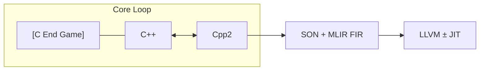

# Project Objectives

## 1. Core Loop: C++ ↔ Cpp2 (Isomorphic Transpilation)
The foundation of the project is a tight, isomorphic validation loop between **C++** and **Cpp2**.
- **Goal**: Ensure semantic equivalence and lossless roundtrip capability within this core loop.
- **"C End Game"**: This loop acknowledges C as a stable ABI/target context, though direct C generation is lower priority than the C++ ↔ Cpp2 bond.
- **Purpose**: This layer serves as the "source of truth" and corpus host.

## 2. Analysis Pipeline: → SON + MLIR FIR
From the core loop, code flows into the **Sea-of-Nodes (SON)** and **MLIR FIR** pipeline.
- **Input**: High-fidelity IR derived from the C++/Cpp2 core.
- **Role**:
    - **Safety Analysis**: Implement "borrow checker" logic (lifecycle, bounds, null safety).
    - **Optimization**: Graph-based transformations on the Sea-of-Nodes representation.
    - **Minimization**: This stage avoids n-way mapping complexity by operating on a unified graph representation.

## 3. Backend: → LLVM ± JIT
The final stage targets **LLVM** for code generation and execution.
- **Targets**:
    - **AOT**: Standard LLVM compilation for binaries.
    - **JIT**: Just-In-Time execution capabilities (where applicable).
- **Flow**: The optimized/verified graph from the analysis pipeline is lowered to LLVM IR.

## 4. Semantic Grounding via Clang
Leverage **Clang AST** to reverse-map semantic features of the C++ language to the Cpp2/Cppfort variant.
- **Goal**: Extend and verify the semantic foundations of Cpp2 by cross-referencing with standard C++ semantics extracted via Clang.

## Summary Flow

