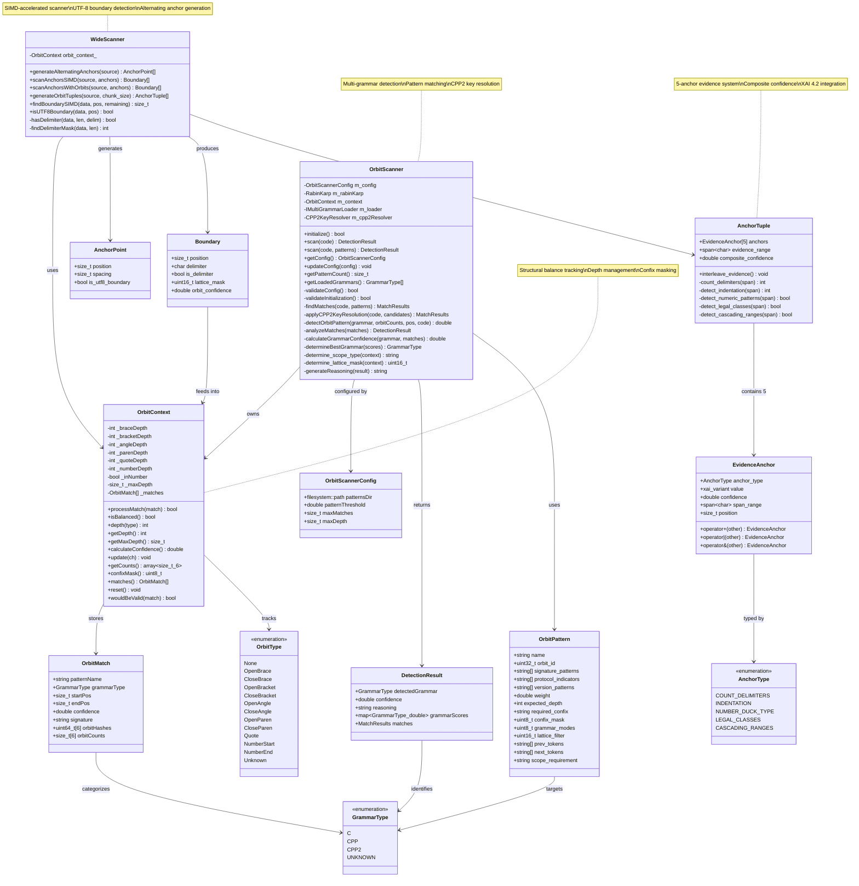
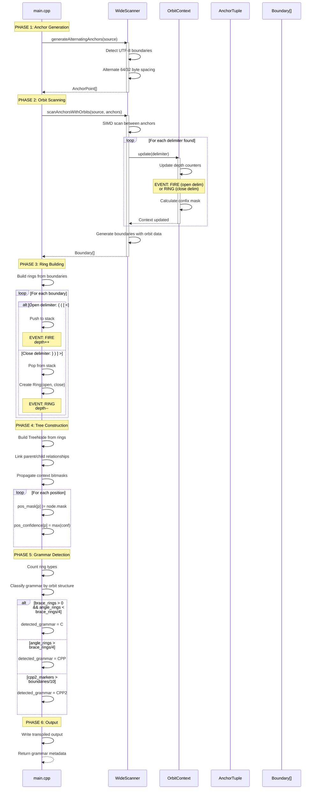
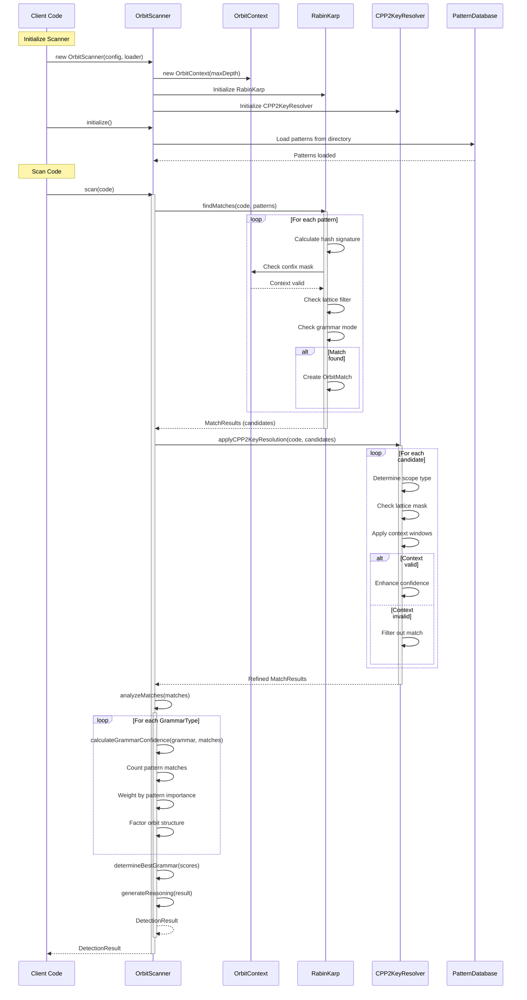

# Stage0 Orbit Scanner Architecture

## Overview

The stage0 orbit scanner implements a multi-layer architecture for grammar detection and transpilation using SIMD-accelerated scanning, orbit-based structural analysis, and evidence-based pattern matching.

## Architecture Diagram



## Event Flow: Scanning and Transpilation



## Advanced Pattern Matching Flow



## Event Types and Their Significance

### FIRE Events
**Triggered by:** Opening delimiters `{`, `(`, `[`, `<`, `"`

**Actions:**
- Push delimiter position to corresponding stack
- Increment depth counter for delimiter type
- Update confix context mask
- Record position in orbit tracking

**Significance:** Marks the beginning of a structural orbit region

### RING Events
**Triggered by:** Closing delimiters `}`, `)`, `]`, `>`, `"`

**Actions:**
- Pop matching opening delimiter from stack
- Create Ring structure with {open_pos, close_pos, delim, depth}
- Decrement depth counter
- Update confix context mask
- Calculate orbit confidence based on depth

**Significance:** Completes a structural orbit, enabling grammar classification

### Boundary Detection
**Triggered by:** SIMD scan finding delimiters or UTF-8 boundaries

**Data captured:**
- Position in source
- Delimiter character
- Lattice mask (byte-level classification)
- Orbit confidence from context

**Significance:** Provides anchor points for ring construction and evidence gathering

### Grammar Classification
**Triggered by:** Analysis of ring patterns after full scan

**Decision criteria:**
- C: High brace/paren ratio, low angle brackets
- CPP: Significant angle brackets (templates)
- CPP2: High density of `:` and `=` markers

**Significance:** Determines transpilation strategy and output format

### Context Switching via Bitmasks
**Triggered by:** FIRE and RING events

**Bitmask structure (confixMask):**
```
Bit 0: TopLevel (depth == 0)
Bit 1: InBrace  ({...})
Bit 2: InParen  ((...))
Bit 3: InAngle  (<...>)
Bit 4: InBracket ([...])
Bit 5: InQuote   ("...")
```

**Significance:** Enables context-aware pattern matching and disambiguation

## XAI 4.2 Anchor System

### Five Anchor Types

1. **COUNT_DELIMITERS**: Array bounds, loop constructs, repetition patterns
2. **INDENTATION**: Scope-based evidence from whitespace patterns
3. **NUMBER_DUCK_TYPE**: Numeric literal classification and type inference
4. **LEGAL_CLASSES**: Valid C++2/CPP2 type constructs and metaclass patterns
5. **CASCADING_RANGES**: Hierarchical evidence propagation through spans

### Evidence Interleaving

All 5 anchor types fire concurrently on the same span, each contributing:
- Individual confidence score (0.0-1.0)
- Evidence value (count, span, or score)
- Position and span range

**Composite confidence** = Average of all 5 anchor confidences

### Evidence Operators

- `anchor1 + anchor2`: Merge spans, average confidence
- `anchor1 | anchor2`: Alternative, take higher confidence
- `anchor1 & anchor2`: Intersection, minimum confidence

## Key Architectural Patterns

### Alternating Anchor Strategy
Generates anchor points at UTF-8 boundaries with alternating 64/32 byte spacing, optimizing for SIMD processing while maintaining character boundary alignment.

### Hierarchical Orbit Tracking
Maintains separate depth counters for each delimiter type, enabling precise structural analysis and pattern disambiguation.

### N-Way Grammar Detection
Concurrent evaluation of multiple grammar hypotheses (C, CPP, CPP2) with confidence scoring and pattern-based disambiguation.

### Context-Aware Pattern Matching
Patterns specify required context via confix masks, depth constraints, and scope requirements, enabling accurate detection in ambiguous scenarios.

### Evidence-Based Confidence
Combines multiple evidence sources (orbit structure, pattern matches, context validity) into composite confidence scores for robust grammar detection.

## Performance Characteristics

- **SIMD Acceleration**: 16-byte parallel processing for boundary detection
- **UTF-8 Boundary Detection**: Efficient multi-byte character handling
- **Alternating Anchors**: Balances granularity with processing overhead
- **Orbit Caching**: Position-indexed masks and confidence scores
- **Pattern Pre-filtering**: Lattice masks reduce pattern search space

## File Locations

- Main transpiler: `/Users/jim/work/cppfort/src/stage0/main.cpp`
- SIMD scanner interface: `/Users/jim/work/cppfort/src/stage0/wide_scanner.h`
- Orbit scanner: `/Users/jim/work/cppfort/src/stage0/orbit_scanner.h`
- Orbit context and masks: `/Users/jim/work/cppfort/src/stage0/orbit_mask.h`
- XAI anchor types: `/Users/jim/work/cppfort/src/stage0/xai_orbit_types.h`
- Pattern definitions: `/Users/jim/work/cppfort/src/stage0/tblgen_patterns.h`
